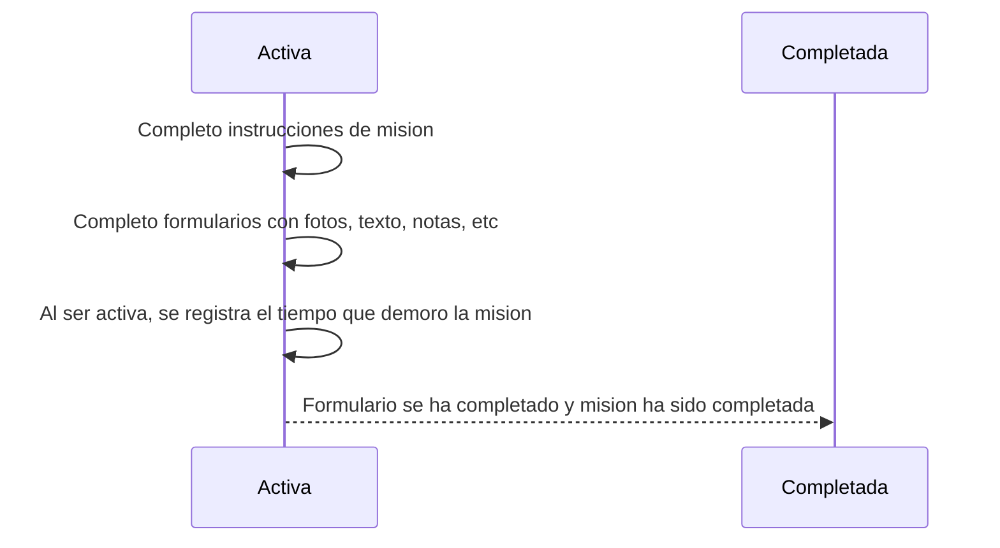

# Misiones

Las Misiones son las tareas que nos fueron asignadas las cuales incluyen instrucciones como agregar fotos, ubicacion GPS, ingreso de texto, entre otras. 

Las misiones pueden contar con parametros obligatorios los cuales se mostraran con un asterisco rojo

Al final de cada mision, se muestran las siguientes opciones para actualizar el estado

 - **Activa**, Las misiones son marcadas como activas cuando la tarea tiene una duracion la cual deseamos medir y/o no es posible terminar inmediatamente. Marcaremos la tarea como activa cuando empecemos a trabajar en ella y completada cuando llenemos todos los parametros de la mision. 
 - **Completada**, Las misiones que han llenado los formularios e instrucciones solicitadas por el encargado de equipo seran marcadas como completadas
 - **Cancelada**, Son misiones las cuales nos fueron indicadas abandonar y/o proceder alguna otra actividad mas importante.
 - **Fallo**, Las misiones marcadas con esta propiedad no pudieron ser terminadas por razones de fuerza mayor. Como por ejemplo un accidente, persona visitada no se encontraba, medio de transporte con desperfectos, etc. 

El estado de misiones **Activas** es util cuando :

 1. Se desea registar el tiempo de duracion de una mision
 2. La mision no puede completarse inmediatamente en un lugar y hora en especifico sino requiere moverse de lugar y/o esperar algun evento. 

Un flujo demo es el siguiente: 

Una tarea puede ser marcada como **Completada**, **Fallo** o **Cancelada** inmediatamente. Como por ejemplo al visitar a un cliente y se solicita entregarle producto, si el cliente se encuentra disponible se llenara el formulario de entrega y se actualiza el estado de la tarea como **Completada**. Si el cliente no se encuentra disponible la marcaremos como **Fallo** e indicaremos la razon por la cual fue la mision fallo. Si surgio una visita a un cliente con mayor urgencia marcaremos la mision como **Cancelada** e indicaremos la razon de su cancelacion. 

Explora las Misiones desde el APP en el siguiente video! 
<iframe width="560" height="315" src="https://www.youtube.com/embed/lLTF__ua5go" frameborder="0" allow="accelerometer; autoplay; encrypted-media; gyroscope; picture-in-picture" allowfullscreen></iframe>

> Siguiente [Crear una Mision](/v1/app-movil/crear_mision.html)

> O regresa a [Sincronizacion](/v1/app-movil/sync.html)
<!--stackedit_data:
eyJoaXN0b3J5IjpbLTUzNDM4NDMyNCwxNzAyMzMxOTYsLTQ5Mz
UxNjIxNywtMTE3MDU1MTA2OF19
-->