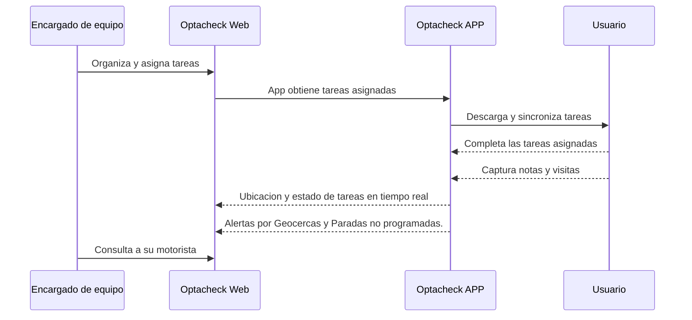

# Tutoriales Optacheck

En los siguientes links encuentra  guias rapidas del uso de diferentes funcionalidades de Optacheck. 

Un flujo ejemplo entre el usuario y personal es el siguiente:

 - Llamaremos a **usuarios** a las personas que usaran el APP y recibiran instrucciones. 
 - Llamaremos a **encargados de equipo** a quienes asignan tareas y acciones a **usuarios**
 - Optacheck Web es el [Portal](https://optacheck.com/welcome/) donde el **encargado de equipo** localiza, asigna y visualiza tareas de sus **usuarios**
 - Optacheck APP es la [Aplicacion](https://play.google.com/store/apps/details?id=com.optagonal.optacheck) que los **usuarios** descargaran y usaran para comunicar al **encargado de equipo** 

Elige entre las siguientes opciones para entrar al tutorial
> Ingresa a [Web App](/v1/web-app/) Para información del uso de la plataforma web desde un explorador web (Chrome, Firefox, Opera, etc). 

> Ingresa a [App movil](/v1/app-movil/) para información del uso de la aplicación iOS y Android

> Ingresa a [FAQ](/v1/faq/) para resolución de dudas y problemas mas comunes 

> Ingresa a [Developer](/v1/developer/) mostramos el uso del API, documentacion e implementacion. 

Si estas guías no resuelven tus dudas, escribenos a soporte@somosopta.com 

<!--stackedit_data:
eyJoaXN0b3J5IjpbMjAxNjYwNjIxOSwzNzA0MzQ4NzcsLTEyMT
c2ODA0NDYsLTIwNzAzNTQ2NzIsMTI2NDE1NTAzMV19
-->