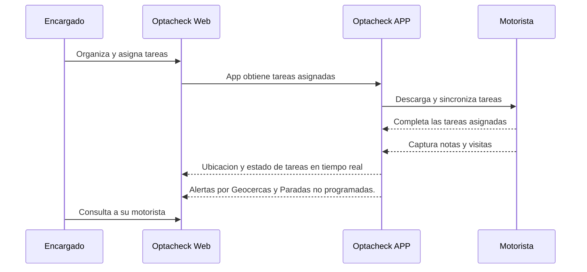

# Tutoriales Optacheck

En los siguientes links encuentra  guias rapidas del uso de diferentes funcionalidades de Optacheck. 

Un flujo ejemplo entre el usuario y personal es el siguiente:

Elige entre las siguientes opciones para entrar al tutorial
> Ingresa a [Web App](/v1/web-app/) Para información del uso de la plataforma web desde un explorador web (Chrome, Firefox, Opera, etc). 

> Ingresa a [App movil](https://stackedit.io/) para información del uso de la aplicación iOS y Android

> Ingresa a [FAQ](https://stackedit.io/) para resolución de dudas y problemas mas comunes 

> Ingresa a [Developer](https://stackedit.io/) mostramos el uso del API e implementacion. 

Si estas guías no resuelven tus dudas, escribenos a soporte@somosopta.com 

<!--stackedit_data:
eyJoaXN0b3J5IjpbLTEyMTc2ODA0NDYsLTIwNzAzNTQ2NzIsMT
I2NDE1NTAzMV19
-->